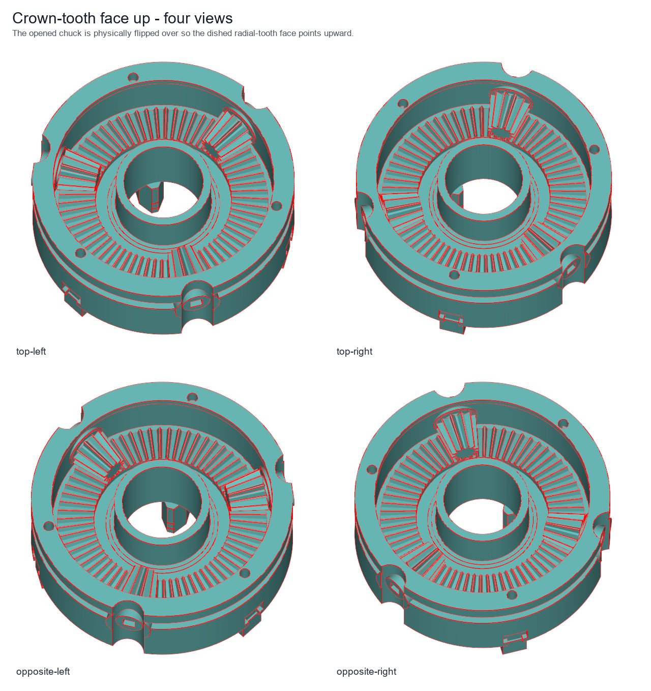
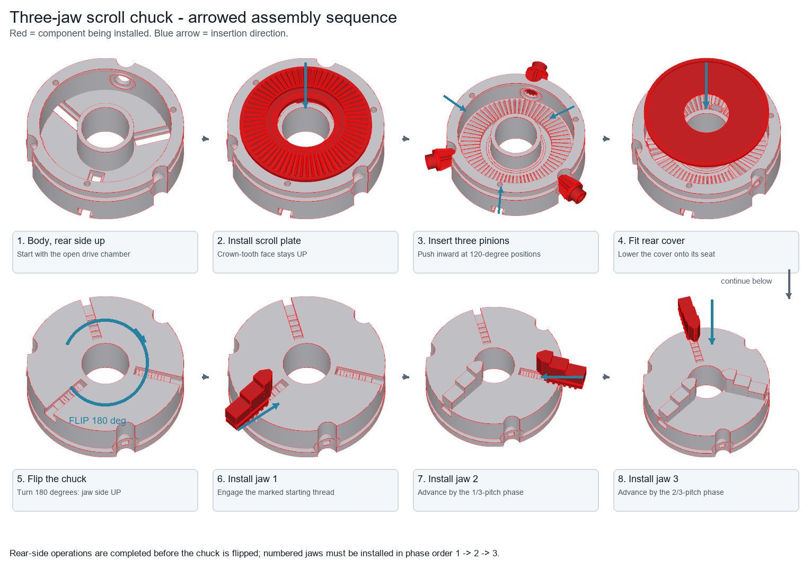
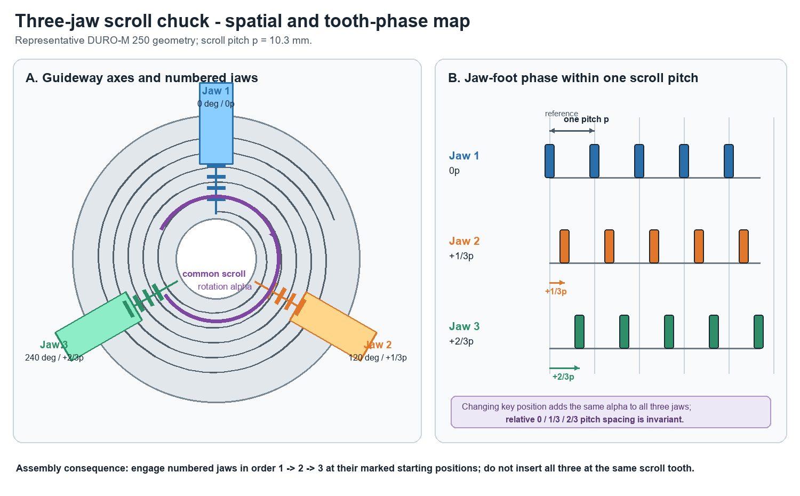

# three_jaw_scroll_chuck - evidence, derivations, and scope

## Catalog mapping

The RÖHM DURO-M catalogue supplies the envelope, mounting, jaw, and chucking
range data for this family. Each `catalog_index` chooses one complete row;
dimensions are never mixed between catalog products.

| Catalog symbol | Parameter | Model use |
| --- | --- | --- |
| A / B / C / D / E / F / G / K | `outer_dia_A` through `key_square_K` | chuck OD, rear register, height, bore, mounting, and key socket |
| BB jaw A / B / C / D / E / F / G / H | `jaw_length_A` through `jaw_step_H` | stepped jaw, scroll pitch, retained foot, and two H risers |
| A1 | `grip_min_A1`, `grip_max_A1`, `jaw_open_fraction` | operating clamp diameter |

Source: RÖHM lathe-chuck catalogue, DURO-M cylindrical centre mount DIN 6350
and outward-stepped BB jaw tables (printed pages 3044, 3048, and 3060; linked
in `family.json`). `clamp_d` is derived only from the selected row's A1 range.

## Kinematic structure

```text
key socket -> radial bevel pinion -> crown wheel on scroll back
           -> Archimedean scroll thread -> three jaw-foot arc teeth
           -> retained radial T-guideways
```

The body, rear cover, scroll plate, three jaws, and three pinions are nine
separate solids. The merged #82 foundation is retained: the jaw teeth span the
whole underside, the T-slot floor is relieved outside the scroll chamber, and
the scroll key position is selected in whole crown-tooth increments. This
preserves crown mesh while choosing usable jaw-tooth engagement.

The guideway axes are at 0 / 120 / 240 degrees. Their underside tooth windows
are staggered by 0 / 1/3 / 2/3 of one scroll pitch. The common key-position
rotation changes all three together, so it cannot erase that relative phase.

The BB drawing labels H on each jaw riser. Every catalog row has C > 2H, so
the two modeled drops are exactly H and 2H; they are not silently clipped.

## Visual review package

All explanatory images below are generated from the same representative
DURO-M 250 parameter row used by the model. They illustrate modeled geometry
and assembly relationships; they are not additional dimensional sources.

### Crown-tooth face and rear service chamber

The four-view sheet physically flips the opened chuck so the toothed reverse
face points upward, making the crown and pinion relationship easy to inspect.



A larger single inspection view is also available in
[`preview_rear_cover_removed.png`](preview_rear_cover_removed.png).

### Arrowed assembly order

Red identifies the component being installed and blue arrows give the
insertion direction. Rear-side work is completed first: scroll plate with
crown teeth upward, three radial pinions, then rear cover. The chuck is then
flipped and numbered jaws are installed in order 1, 2, 3.



### Three-jaw position and tooth phase

The spatial guideway axes remain 0 / 120 / 240 degrees apart. The linearized
tooth rows show the separate 0 / 1/3 / 2/3-pitch starting offsets. A common
scroll rotation adds the same angle to every jaw and therefore preserves the
relative phase.



## Teardown-informed details

The supplied teardown video is used only as structural evidence, not as a
dimensional source: [Pierre's Garage - 3 or 6 jaws lathe scroll chuck
explanation](https://youtu.be/hxmQ1hP-gUA). It confirms a removable scroll,
back-side crown drive, radial key pinions, and central support/retention forms.

- The scroll has a stepped annular rear support land around its central opening.
- The bowl-shaped part with the full ring of radial teeth in the teardown is
  the removable scroll plate's reverse face, exposed after the rear cover is
  removed. The model therefore keeps those teeth on the rotating scroll, not
  on the fixed body. The crown band is widened toward both the central land
  and outer rim so the reverse face reads as a toothed shallow bowl.
- The fixed body retains the three front T-guideways. Behind them, a rear
  service chamber runs from the removable cover seat to the crown clearance
  plane, retaining only the outer wall and central sleeve. Removing the cover
  therefore exposes the toothed scroll bowl and three pinions as in the video.
- The body keeps catalog diameter A at its lower mounting flange and upper
  front rim, but has a proportioned relieved middle band. This follows the
  stepped housing visible in the teardown without claiming an unpublished
  RÖHM section dimension.
- Each radial pinion has an integrated thrust collar and the body has the
  matching stepped recess. Each is carried in a substantial integral body
  boss, rather than a bare rim hole. These remain parts of the pinion/body,
  not invented loose washers or bearing bodies.
- The retained scroll diameter is 0.84 A. It leaves a body wall while covering
  the full published jaw travel with the real scroll band.

## Gear-standard boundary

The three radial pinions and the scroll-back crown wheel are modeled as a
90-degree straight-bevel pair. [ISO 23509-1:2025](https://www.iso.org/standard/85503.html)
defines bevel-gear macro geometry; it is the applicable geometry reference for
this pair. The code retains a transparent planar-flank approximation because
the public catalog does not disclose the actual tooth system, module, pressure
angle, correction, or backlash.

[ISO 10300-1:2023](https://www.iso.org/standard/79401.html) concerns bevel-gear
load-capacity calculation. It would require transmitted torque, material,
hardness, and service data that are not public for this product, so this model
makes no strength or manufacturing-quality claim.

[ISO 54:1996](https://www.iso.org/standard/22644.html) lists preferred modules
for cylindrical gears. It is not used to claim that this bevel pair complies
with ISO 54. Likewise, [ISO 21771-1:2024](https://www.iso.org/standard/84949.html)
covers involute cylindrical gear pairs, not the scroll's non-constant-ratio
Archimedean band and jaw arc teeth. The scroll interface is therefore declared
as a documented geometric proportion, not mislabeled an ISO involute gear.

## Checks mirrored in `spec.py:check`

- Catalog values must match their selected row and `clamp_d` must stay in A1.
- The two jaw risers require C > 2H and the three jaw phases are fixed at
  0 / 1/3 / 2/3 pitch.
- At 101 equally spaced A1 positions, including both endpoints and every jaw,
  the exact model helpers must retain at least two engaged scroll teeth.
- The T-foot retains at least 30 percent of jaw length, and the jaw noses must
  not collide at the selected clamp diameter.
- Mounting holes are intentionally labeled proportions where catalog drawings
  do not publish drill details: 0.85 G blind tapped bores in the body and
  clearance bores in the cover.

## Deliberate simplifications

This is not a production-manufacturing claim. The model does not assert actual
octoid/involute flank curvature, tooth modifications, backlash tolerance,
material, heat treatment, load rating, cover screws, or small edge breaks.
Those facts are not supplied by the public catalog or teardown video.
