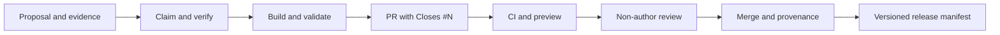

# Walkthrough: from proposal to a merged family

*中文: [WALKTHROUGH.zh.md](WALKTHROUGH.zh.md)*

Every accepted family becomes an auditable BenchCAD 2.0 parametric design.

## The lifecycle



## 1. Propose a family

Open a **Family request**. Supply:

- a real standard, catalog, datasheet, handbook, or stated proportion basis;
- a dimensioned drawing or equivalent symbol-to-geometry source;
- a table or documented parameter range with minimum and maximum examples;
- any engineering constraints you already know.

The proposal must include enough linked evidence for another contributor to
verify it independently.

## 2. Verify before coding

Claim the issue, check that its links work, map drawing symbols to dimensions,
and manually verify at least two table values or equations. If evidence is
missing, add `needs-evidence` and describe the gap instead of guessing.

## 3. Scaffold and implement

```bash
uv sync
uv run bench2 new my_family
```

Complete:

| File | What belongs there |
|---|---|
| `part.py` | Plain CadQuery `build(<named params>)` returning one solid |
| `spec.py` | `PARAM_SPEC`, engineering `check()`, optional coupled `refine()` |
| `family.json` | Labels, source summary, and contributor |
| `NOTES.md` | Recommended symbol/formula verification for equation-heavy designs |

The generated files contain annotated TODOs. The full contract is in
[`DESIGN_SPEC.md`](DESIGN_SPEC.md).

## 4. Validate and inspect

```bash
uv run bench2 validate my_family
uv run bench2 preview my_family
```

Validation checks the declared parameter contract, constraints, deterministic
sampling, derived-program execution, geometry diversity, and helper inlining.
Then inspect `preview.png`, `preview_views.png`, and `preview_extremes.png`
yourself. Compare the geometry and both range extremes against the issue's
reference evidence.

For interactive inspection:

```bash
uv run python tools/debug_family.py my_family --diff hard --seed 3
```

See [`DEBUGGING.md`](DEBUGGING.md) for viewer options.

## 5. Submit and review

Commit with DCO sign-off and open one PR touching only the family directory:

```bash
git add designs/my_family
git commit -s -m "Add my_family"
git push
```

Put `Closes #<issue-number>` in the PR description. CI reruns validation and
generates previews. One non-author follows [`REVIEWING.md`](../REVIEWING.md),
checking source evidence, renders, equations, constraints, labels, and scope.

After merge, automation closes the issue, posts acceptance evidence, refreshes
[`CONTRIBUTORS.md`](../CONTRIBUTORS.md), and updates
[`STATUS.md`](../STATUS.md).

## Common problems

- Sampling violates `check()` → make the declared ranges and true engineering
  constraints consistent; do not remove a real constraint.
- A coupled value leaves its range → fix or resample it in `refine()` while
  preserving the declared contract.
- Preview disagrees with the drawing → correct the geometry before opening the
  PR.
- No coding environment → use the **Part proposal** issue form; engineering
  evidence alone is a credited contribution.
