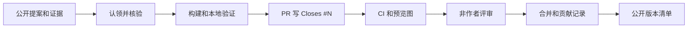

# 教程：从提案到合并一个公开 family

*English: [WALKTHROUGH.md](WALKTHROUGH.md)*

每个被收录的 family 都会成为一份可审计的 BenchCAD 2.0 参数化设计。

## 全流程



## 1. 提案

用 **Family request** 表单新建 issue，并提供：

- 真实的标准、目录、datasheet、手册，或明确标为比例惯例的依据；
- 带尺寸的工程图，或其它能把符号映射到几何的资料；
- 含最小/最大实例的尺寸表或参数范围；
- 已知的工程约束。

提案必须包含足够的可核验资料，让另一位贡献者能够独立复查。

## 2. 写代码前先核验

认领 issue 后检查链接、把工程图符号映射到参数，并亲手复核至少两个表格值或
公式。资料不够就加 `needs-evidence` 标签并写清缺口，不要猜标准号或尺寸。

## 3. 生成骨架并实现

```bash
uv sync
uv run bench2 new my_family
```

| 文件 | 内容 |
|---|---|
| `part.py` | 普通 CadQuery 的 `build(<具名参数>)`，返回一个实体 |
| `spec.py` | `PARAM_SPEC`、工程 `check()`、可选的耦合 `refine()` |
| `family.json` | 公开标签、来源摘要和贡献者 |
| `NOTES.md` | 公式型零件建议记录符号/公式核验 |

生成的文件已经写好逐项 TODO。完整接口见
[`DESIGN_SPEC.md`](DESIGN_SPEC.md)。

## 4. 验证并看图

```bash
uv run bench2 validate my_family
uv run bench2 preview my_family
```

验证会检查参数契约、约束、确定性抽样、派生程序执行、几何多样性和 helper
内联。随后必须亲自检查 `preview.png`、`preview_views.png` 和
`preview_extremes.png`，把几何和范围两端与 issue 里的公开证据并排对照。

交互查看可运行：

```bash
uv run python tools/debug_family.py my_family --diff hard --seed 3
```

viewer 说明见 [`DEBUGGING.md`](DEBUGGING.md)。

## 5. 提交和评审

```bash
git add designs/my_family
git commit -s -m "Add my_family"
git push
```

PR 只能修改这一个 family 目录，描述里写 `Closes #<issue编号>`。CI 会重跑
验证并生成预览图；一位非作者按 [`REVIEWING.md`](../REVIEWING.md) 检查来源、
渲染、公式、约束、标签和改动范围。

合并后，机器人会关闭 issue、贴回验收证据、刷新
[`CONTRIBUTORS.md`](../CONTRIBUTORS.md) 和 [`STATUS.md`](../STATUS.md)。这个
family 从此永久属于公开集。

## 常见问题

- 抽样违反 `check()`：让范围和真实工程约束一致，不要删除正确约束。
- 耦合参数跑出范围：在 `refine()` 中修正或重采样，同时遵守声明契约。
- preview 和图纸不一致：PR 前先修几何。
- 没有代码环境：用 **Part proposal** 表单，只贡献工程证据同样记名。
